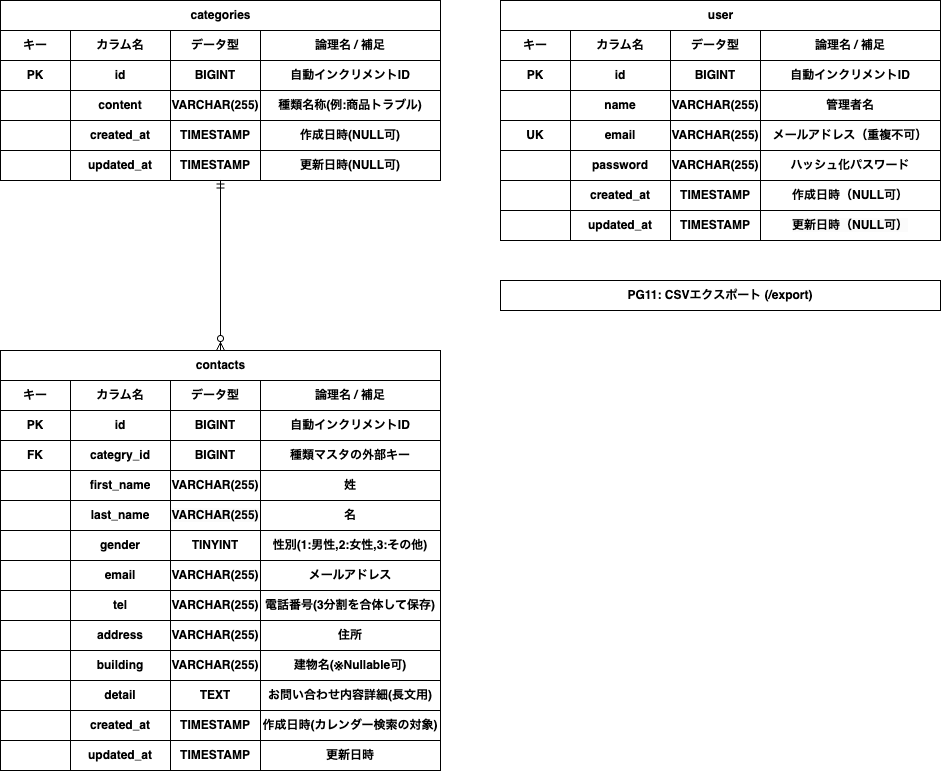

# お問い合わせ管理システム (inquiry)

基礎学習タームの確認テスト用「お問い合わせフォーム ＆ 管理システム」です。

## 👥 画面定義一覧
- **PG01:** お問い合わせフォーム入力ページ (`/`)
- **PG02:** お問い合わせフォーム確認ページ (`/confirm`)
- **PG03:** サンクスページ (`/thanks`)
- **PG04:** 管理画面 (`/admin`)
- **PG05:** 検索 (`/search`) -> `/admin` (GET) 一本化仕様
- **PG06:** 検索リセット (`/reset`) -> `/admin` 遷移仕様
- **PG07:** お問い合わせフォーム削除 (`/delete`)
- **PG08:** ユーザ登録 (`/register`)
- **PG09:** ログイン (`/login`)
- **PG10:** ログアウト (`/logout`)
- **PG11:** CSVエクスポート (`/export`) -> 検索条件完全連動仕様

---

## 🚀 環境構築手順

手元のPC（ローカル環境）で実際に動かすための手順です。コマンドライン（ターミナル）で上から順番に実行してください。

### 1. リポジトリのクローンと移動
```bash
git clone git@github.com:yosiyosi-n/-.git
cd inquiry
```

### 2. ライブラリのインストール
依存パッケージ（Laravel Fortifyなど）をインストールします。
```bash
composer install
npm install && npm run build
```

### 3. 環境設定ファイルの準備
`.env` ファイルを作成し、アプリケーションキーを生成します。
```bash
cp .env.example .env
php artisan key:generate
```

### 4. データベースの設定
`.env` ファイルを開き、自身のローカルDB環境に合わせて以下を修正します。
```env
DB_CONNECTION=mysql
DB_HOST=127.0.0.1
DB_PORT=3306
DB_DATABASE=inquiry
DB_USERNAME=root
DB_PASSWORD=root (または空)
```

### 5. マイグレーションとシーダーの実行
テーブルを作成し、テスト用の管理者ユーザーやお問い合わせ初期データを投入します。
```bash
php artisan migrate:fresh --seed
```

### 6. ルートキャッシュのクリア（重要）
初期ルートの競合を防ぐため、一度キャッシュをクリアします。
```bash
php artisan route:clear
```

### 7. ローカルサーバーの起動
```bash
php artisan serve
```
サーバー起動後、ブラウザで `http://127.0.0.1:8000` にアクセスできれば構築完了です！

---

## 📊 データベース設計 (ER図)

